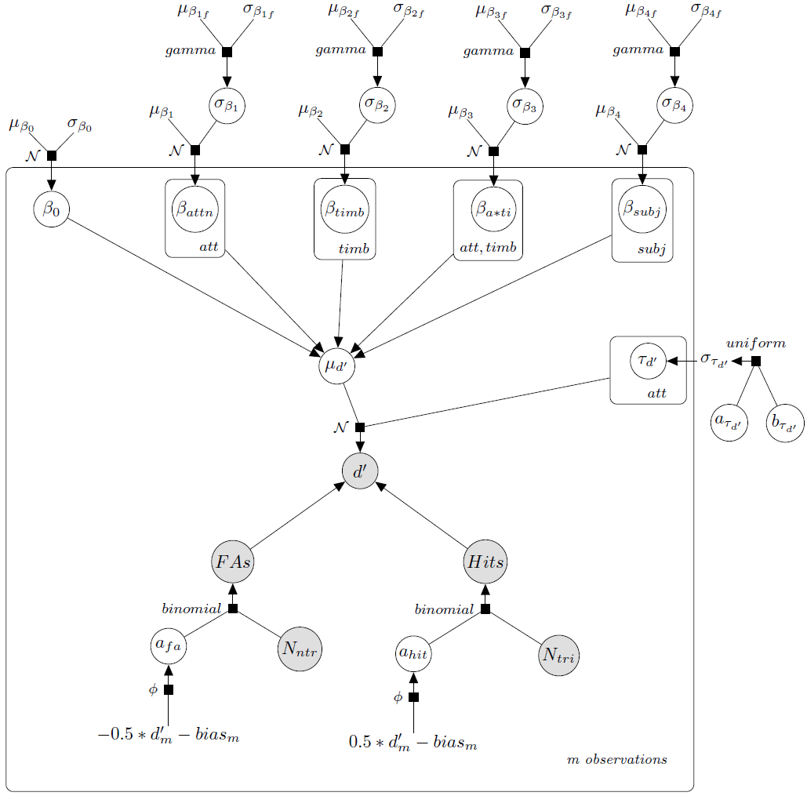

### Bayesian modeling specifications for "Assessing top-down and bottom-up contributions to auditory stream segregation and integration with polyphonic music" by Niels R. Disbergen, Giancarlo Valente, Elia Formisano, and Robert Zatorre ###

This documents is a supplement to the paper (forthcoming) and describes in more detail how the Bayesian model is implemented for the analysis of behavioral data. More general description and details as to why the model has been implemented this way can be found in the paper, a simplified DAG description of the model is presented below.

Bayesian Hierarchical models with Markov Chain Monte Carlo (MCMC) inference were estimated using [JAGS](http://mcmc-jags.sourceforge.net/ "http://mcmc-jags.sourceforge.net/") (Just Another Gibbs Sampler, version 3.3.0) employing the [MATJAGS](http://psiexp.ss.uci.edu/research/programs_data/jags/ "http://psiexp.ss.uci.edu/research/programs_data/jags/") (version 1.3.1) interface in MATLAB 2015a.

Participant responses were classified as hits, misses, false alarms, and correct rejections.
In Experiment 1 three responses per subject (attentive conditions) for twenty nine participants were injected in the model, a total of eighty seven measurements (nMeasures). For experiment 2 there were nine responses recorded per participant: three attentive conditions with three timbre distances each. Nineteen subjects with nine measurements each, a total of hundred seventy one measurements.

Implementation for bias model parameters is identical, only feeding biasEdgeCorrected for model initiation values as opposed to dPrimeEdgeCorrected.

For more information, see also "[Doing Bayesian Data Analysis](https://sites.google.com/site/doingbayesiandataanalysis/ "https://sites.google.com/site/doingbayesiandataanalysis/")" from John R. Kruschke.


### Signal Detection Values ###
D-prime & bias values employed for *model initiation only*
```matlab

trialsTriplet   = hits + misses;
trialsNoTriplet = falseAlarms + correctRejections;

dPrimeEdgeCorrected  = norminv((hits+.5)./(trialsTriplet+1)) - norminv((falseAlarms+.5)./(trialsNoTriplet+1));
biasEdgeCorrected = -1/2*norminv((hits+.5)./(trialsTriplet+1)) - norminv((falseAlarms+.5)./(trialsNoTriplet+1));


```


## Experiment 1 Implementation ##
### JAGS Model Parameters
```matlab

jagsMonitorParams = {'d','c','mu_d','mu_c','tau_c','tau_d',...
                'a0','aAttention','aS','a1SD','aSSD',...
                'c0','cAttention','cS','c1SD','cSSD'};

JagsParams = struct('nMeasures',nMeasures,'hits',hits,'falseAlarms',falseAlarms,...
            'trialsTriplet',trialsTriplet,'trialsNoTriplet', trialsNoTriplet,...
            'attentionFactor',attentionFactor,'subjectFactor',subjectFactor,...
            'nAttentionCond',nAttentionCond,'nSubjects',nSubjects);


```

### JAGS Model initialization values
```matlab

S.a0         = mean(dPrimeEdgeCorrected);
S.aS         = grpstats(dPrimeEdgeCorrected,subjectFactor,'mean')-S.a0;
S.aSSDunabs  = std(S.aS);
S.aAttention = grpstats(dPrimeEdgeCorrected,attentionFactor,'mean')-S.a0;
S.sigma_d    = grpstats(dPrimeEdgeCorrected,subjectFactor,'std')/2;
S.a1SDunabs  = std(S.aAttention);

mcmc_params.init0 = S;

```

### Bayesian Hierarchical Model in JAGS
```jags

# Bayesian estimation of d' for group data employing JAGS

model {

  for (m in 1:nMeasures) {

		hits[m]         ~ dbinom(h[m],trialsTriplet[m])
		falseAlarms[m]  ~ dbinom(f[m],trialsNoTriplet[m])

		h[m]   <- phi(1/2*d[m] - c[m])
		f[m]   <- phi(-1/2*d[m] - c[m])

		d[m]   ~ dnorm(mu_d[m],tau_d[attentionFactor[m]])
		c[m]   ~ dnorm(mu_c[m],tau_c[attentionFactor[m]])

        mu_d[m] <- a0 + aAttention[attentionFactor[m]] + aS[subjectFactor[m]]
        mu_c[m] <- c0 + cAttention[attentionFactor[m]] + cS[subjectFactor[m]]

    }

    a0 ~ dnorm(0,0.001)
	c0 ~ dnorm(0,0.001);


    # factor Attention
		for (jAtt in 1:NumAttCond) {

			aAttention[jAtt] ~ dnorm( 0.0 , a1tau)
			cAttention[jAtt] ~ dnorm( 0.0 , c1tau)

			tau_d[jAtt] <- pow(sigma_d,-2)
			tau_c[jAtt] <- pow(sigma_c,-2)
		}

		sigma_d ~ dunif(0,4)
		sigma_c ~ dunif(0,4)

		a1tau <- 1 / pow(a1SD, 2 )
		a1SD ~ dgamma(1.64,.32)

		c1tau <- 1 / pow(c1SD, 2)
		c1SD ~ dgamma(1.64,.32)


    # factor Subject
		for (jS in 1:nSubjects) {

			aS[jS] ~ dnorm(0.0, aStau)
			cS[jS] ~ dnorm(0.0, cStau)
		}

		aStau <- 1 / pow(aSSD, 2)
		aSSD ~ dgamma(1.64, .32)

		cStau <- 1 / pow(cSSD, 2)
		cSSD~ dgamma(1.64, .32)


}


```

## Experiment 2 Implementation ##
Experiment 2 model is an extension of the Experiment 1 model, including the three Timbre distances and attention-timbre interaction.
### JAGS Model Parameters
```matlab

jagsMonitorParams = {'d','c','mu_d','mu_c','tau_c','tau_d',...
                'a0','aAttention','aTimbre','aAttentionaTimbre','aS','a1SD','a2SD','a1a2SD','aSSD',...
                'c0','cAttention','cTimbre','cAttentioncTimbre','cS','c1SD','c2SD','c1c2SD','cSSD'};

JagsParams = struct('nMeasures',nMeasures,'hits',hits,'falseAlarms',falseAlarms,...
        'trialsTriplet',trialsTriplet,'trialsNoTriplet',trialsNoTriplet,...
        'attentionFactor',attentionFactor,'TimbreFactor',TimbreFactor,'subjectFactor',subjectFactor,...
        'nAttentionCond',nAttentionCond,'NumTimbreDists',NumTimbreDists,'nSubjects', nSubjects);


```

### JAGS Model initialization values
Idem implementation for bias, only injection BiasEdgeCorrected instead of dPrimeEdgeCorrected
```matlab

S.a0         = mean(dPrimeEdgeCorrected);
S.aS         = grpstats(dPrimeEdgeCorrected,subjectFactor,'mean')-S.a0;
S.aSSDunabs  = std(S.aS);
S.aAttention = grpstats(dPrimeEdgeCorrected,attentionFactor,'mean')-S.a0;
S.aTimbre    = grpstats(dPrimeEdgeCorrected,TimbreFactor,'mean')-S.a0;

S.aAttentionaTimbre = zeros(nAttentionCond,NumTimbreDists);
for idAtt = 1:nAttentionCond
    for idTimbre = 1:NumTimbreDists
        S.aAttentionaTimbre(idAtt,idTimbre) = mean(dPrimeEdgeCorrected(attentionFactor==idAtt & ...
            TimbreFactor == idTimbre)) - S.aAttention(idAtt)*S.aTimbre(idTimbre) - S.a0;
    end
end

S.sigma_d     = grpstats(dPrimeEdgeCorrected,subjectFactor,'std')/2;
S.a1SDunabs   = std(S.aAttention);
S.a2SDunabs   = std(S.aTimbre);
S.a1a2SDunabs = std(S.aAttentionaTimbre);

mcmc_params.init0 = S;

```

### Bayesian Hierarchical Model in JAGS
```jags

# Bayesian estimation of d' for group data employing JAGS

model {

  for (m in 1:nMeasures) {

		hits[m]         ~ dbinom(h[m],trialsTriplet[m])
		falseAlarms[m]  ~ dbinom(f[m],trialsNoTriplet[m])

		h[m]   <- phi(1/2*d[m] - c[m])
		f[m]   <- phi(-1/2*d[m] - c[m])

		d[m]   ~ dnorm(mu_d[m],tau_d[attentionFactor[m]])
		c[m]   ~ dnorm(mu_c[m],tau_c[attentionFactor[m]])

        mu_d[m] <- a0 + aAttention[attentionFactor[m]] + aTimbre[TimbreFactor[m]] + ...
            aAttentionaTimbre[attentionFactor[m],TimbreFactor[m]] + aS[subjectFactor[m]]
        mu_c[m] <- c0 + cAttention[attentionFactor[m]] + cTimbre[TimbreFactor[m]] + ...
            cAttentioncTimbre[attentionFactor[m],TimbreFactor[m]] + cS[subjectFactor[m]]

    }

    a0 ~ dnorm(0,0.001)
	c0 ~ dnorm(0,0.001);


    # factor Attention
		for (jAtt in 1:NumAttCond) {

			aAttention[jAtt] ~ dnorm( 0.0 , a1tau)
			cAttention[jAtt] ~ dnorm( 0.0 , c1tau)

			tau_d[jAtt] <- pow(sigma_d,-2)
			tau_c[jAtt] <- pow(sigma_c,-2)
		}

		sigma_d ~ dunif(0,4)
		sigma_c ~ dunif(0,4)

		a1tau <- 1 / pow(a1SD, 2 )
		a1SD ~ dgamma(1.64,.32)

		c1tau <- 1 / pow(c1SD, 2)
		c1SD ~ dgamma(1.64,.32)


    # factor Timbre
		for (jTimb in 1:NumTimbreDists) {

			aTimbre[jTimb] ~ dnorm(0.0, a2tau)
			cTimbre[jTimb] ~ dnorm(0.0, c2tau)
		}

		a2tau <- 1 / pow(a2SD, 2)
		a2SD ~ dgamma(1.64, .32)

		c2tau <- 1 / pow(c2SD, 2)
		c2SD ~ dgamma(1.64, .32)


    # interaction coefficients
		for (jAtt in 1:NumAttCond) {
			for (jTimb in 1:NumTimbreDists) {

				aAttentionaTimbre[jAtt, jTimb] ~ dnorm(0.0, a1a2tau)
				cAttentioncTimbre[jAtt, jTimb] ~ dnorm(0.0, c1c2tau)
			}
		}

		a1a2tau <- 1 / pow(a1a2SD, 2)
		a1a2SD ~ dgamma(1.64, .32)

		c1c2tau <- 1 / pow(a1a2SD, 2)
		c1c2SD ~ dgamma(1.64, .32)


    # factor Subject
		for (jS in 1:nSubjects) {

			aS[jS] ~ dnorm(0.0, aStau)
			cS[jS] ~ dnorm(0.0, cStau)
		}

		aStau <- 1 / pow(aSSD, 2)
		aSSD ~ dgamma(1.64, .32)

		cStau <- 1 / pow(cSSD, 2)
		cSSD~ dgamma(1.64, .32)


}


```

## DAG representation ##
Experiment 2 DAG of Bayesian hierarchical model parameters, indicating modeling structure for d-prime. Bias is modelled equally to d-prime, only injecting bias values; for simplicity bias modelling is omitted from this graph.


Notation based on [Dietz](http://github.com/jluttine/tikz-bayesnet "http://github.com/jluttine/tikz-bayesnet") 2010. _Directed factor graph notation for generative models_. Max Planck Institute for Informatics, Tech. Rep.


### JAGS model fitting for Experiment 1 & 2
``` matlab

mcmc_params.nchains = 10;
mcmc_params.nburnin = 2000;
mcmc_params.nsamples = 10000;
mcmc_params.doparallel = 1;
mcmc_params.nthin = 1;
mcmc_params.dic = 1;


[JagsSample, JagStats] = matjags( ...
    JagsParams, modelFilePath, mcmc_params.init0, 'doparallel' , ...
    mcmc_params.doparallel, 'nchains', mcmc_params.nchains, ...
    'nburnin', mcmc_params.nburnin,'nsamples', mcmc_params.nsamples, ...
    'thin', mcmc_params.nthin, 'dic', mcmc_params.dic, ...
    'monitorparams', JagsMonitparams, ...
    'savejagsoutput' , 1 , 'verbosity' , 1 , 'cleanup' , 1 , ...
    'workingdir', 'tmpjags');

```

**Niels R. Disbergen - Giancarlo Valente - 2016**
